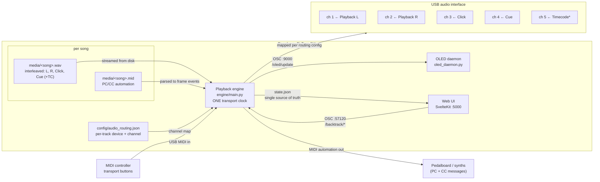

# LANTH0N 5YNTH

**Headless live-playback rig for the Raspberry Pi Zero 2W: backing tracks,
click, cue, and MIDI automation — one clock, zero synthesis.**

The Zero 2W plays pre-rendered, per-song **multichannel WAV** backing tracks
in perfect sync with a companion **Standard MIDI File** automation track,
controlled from a web UI, physical MIDI controllers, and an OLED display.
Live synthesis runs on a separate, more powerful board (out of scope here).

## Hardware

- **Raspberry Pi Zero 2W** — playback/click/cue/MIDI dispatch only (512 MB RAM, headless)
- **USB audio interface** — class-compliant, ≥4 outputs recommended (hot-swappable)
- **USB MIDI controller(s)** — transport control (Play / Stop / Next / Prev)
- **USB MIDI out** — automation target (PC/CC to a pedalboard), can share the interface
- **SSD1306 OLED** (I2C) — local status: setlist, song, tuning, transport state

## How it works

Each song is exactly **one multichannel interleaved WAV + one Standard MIDI
File**, both authored/exported from Reaper:

| WAV channel | Track | Typical destination |
|---|---|---|
| 1 | **Playback L** | FOH left |
| 2 | **Playback R** | FOH right |
| 3 | **Click** | drummer IEM |
| 4 | **Cue** | IEM |
| 5 | **Timecode** (optional) | wherever needed |

A single Python **playback engine** (`engine/`) owns one authoritative
transport clock (the audio stream's frame counter @ 48 kHz):

- Audio is **streamed from disk** block-by-block — memory stays flat
  regardless of song length or setlist size (the direct fix for the OOMs
  that forced this rewrite).
- The MIDI file is pre-parsed once into a sorted `(frame, message)` list
  using its own tempo map, then dispatched from the **same frame counter**
  — audio channels and automation can never drift apart.
- The next song's file handles are pre-cued in the background, so
  Next/Prev switch without a disk-read stall.
- **One source of truth**: the engine writes `config/state.json` on every
  state change; the web UI, MIDI controllers, and OLED all read from /
  act on that single state.

### Signal routing



`*` Timecode only when the rendered WAV has 5 channels and it is enabled
in the routing screen.

## Project Structure

```
├── engine/               # Playback engine (Python)
│   ├── main.py           # entry point (python3 -m engine.main)
│   ├── engine.py         # transport, block renderer, MIDI dispatch, OSC
│   ├── song.py           # one WAV + one MID per song, streamed from disk
│   ├── smf.py            # Standard MIDI File parser (tempo map → frames)
│   ├── devices.py        # live audio/MIDI enumeration + routing resolver
│   ├── midi_io.py        # transport mapping, learn capture, dispatcher
│   ├── osc.py            # control OSC :57120 + OLED OSC :9000
│   ├── transport.py      # single source of truth (stopped/cued/playing)
│   └── statefile.py      # state.json + last_setlist persistence
├── web/                  # SvelteKit web UI (playback-only)
│   └── src/routes/       # dashboard, files, setlists, midi, routing
├── config/
│   ├── audio_routing.json  # per-track device/channel assignments
│   ├── midi_map.json       # MIDI transport mappings (channel-based)
│   ├── state.json          # engine-written playback state (runtime)
│   └── devices.json        # engine-written live device snapshot (runtime)
├── setlists/             # setlist JSON: songs with wav + mid + tuning + key
├── deploy/
│   ├── setup.sh          # automated Pi setup
│   └── *.service         # systemd units
├── oled_daemon.py        # SSD1306 OLED display daemon (OSC :9000)
├── tests/                # offline test suite (./tests/run_tests.sh)
├── AUDIT.md              # Step-0 codebase audit (pre-rewrite)
└── TEST_LOG.md           # verification evidence per build step
```

## Quick Start

```bash
# On the Pi:
git clone https://github.com/lucasaor/lanthon-synth.git
cd lanthon-synth
sudo ./deploy/setup.sh
sudo reboot

# After reboot, all services start automatically:
#   lanthon-engine  — playback engine (python3 -m engine.main)
#   lanthon-oled    — OLED display daemon
#   lanthon-web     — web UI on http://<pi>.local:5000
```

See [DEPLOY.md](DEPLOY.md) for full setup, upgrade, and troubleshooting.

## Daily use

1. **Upload files** (`/files`) — one multichannel WAV + one MID per song.
2. **Build a setlist** (`/setlists`) — per song: WAV, MID, tuning, key.
3. **Map transport** (`/midi`) — MIDI-learn Play/Stop/Next/Prev to your controller.
4. **Route channels** (`/routing`) — pick device + channel for Playback L/R,
   Click, Cue, Timecode, and the MIDI automation output. The device list is
   enumerated live; hot-plug a different interface and re-map on the spot.
5. **Play** from the dashboard or the controller — same actions, same state.
   Next/Prev during playback switches songs immediately (auto-play).

MIDI control details and the full mapping reference: [CONTROLS.md](CONTROLS.md).

## Development & testing

```bash
python3 -m venv .venv && .venv/bin/pip install soundfile numpy python-rtmidi python-osc Pillow
cd web && npm install && npm run build && cd ..
.venv/bin/python3 -m engine.main --offline --setlist <name>   # hardware-free run
./tests/run_tests.sh                                          # full offline suite
```

All engine tests run **offline** (deterministic, no audio hardware needed)
and assert frame-exact MIDI dispatch and flat memory. See [TEST_LOG.md](TEST_LOG.md).

## License

MIT — see [LICENSE](LICENSE).
